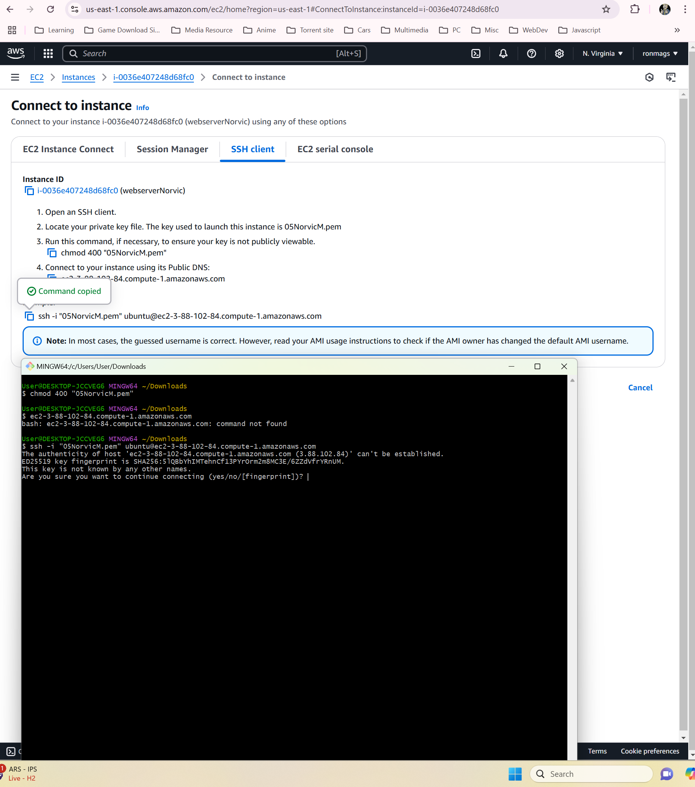
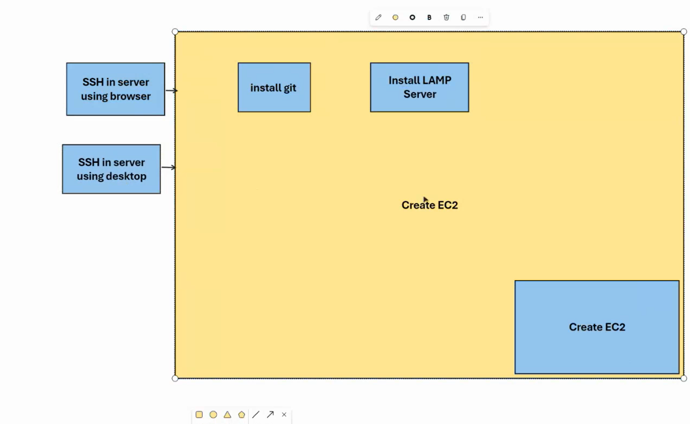
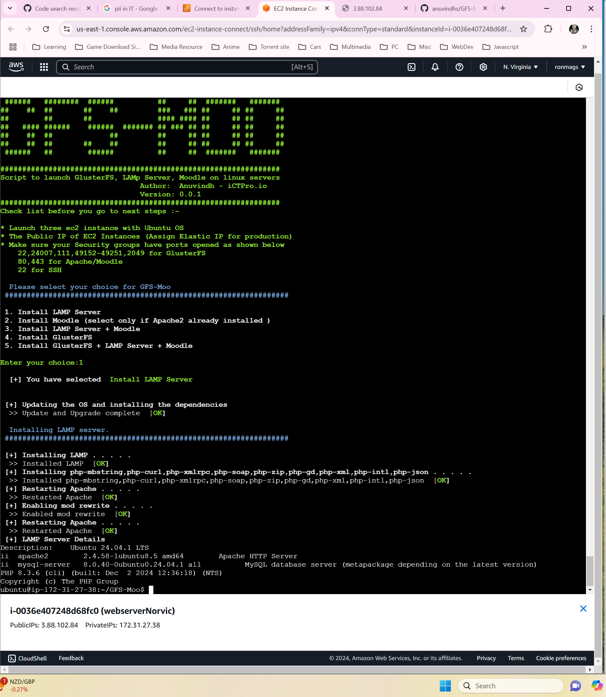
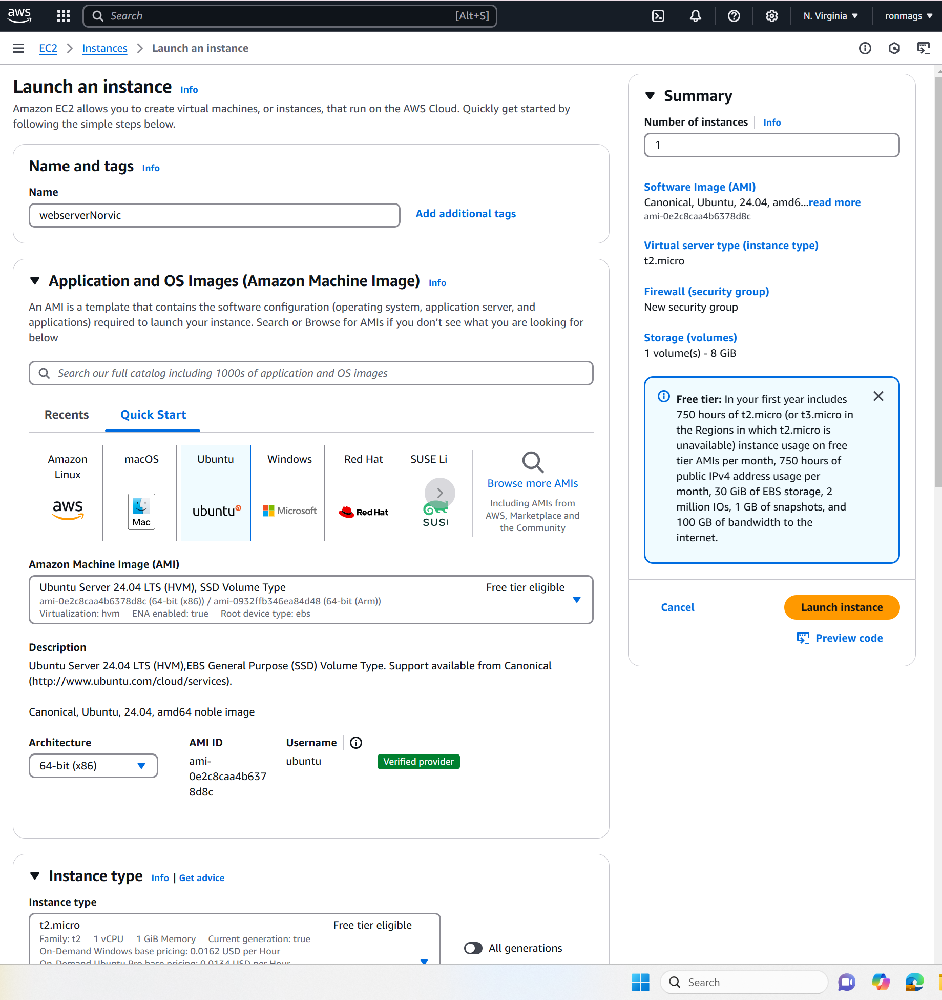
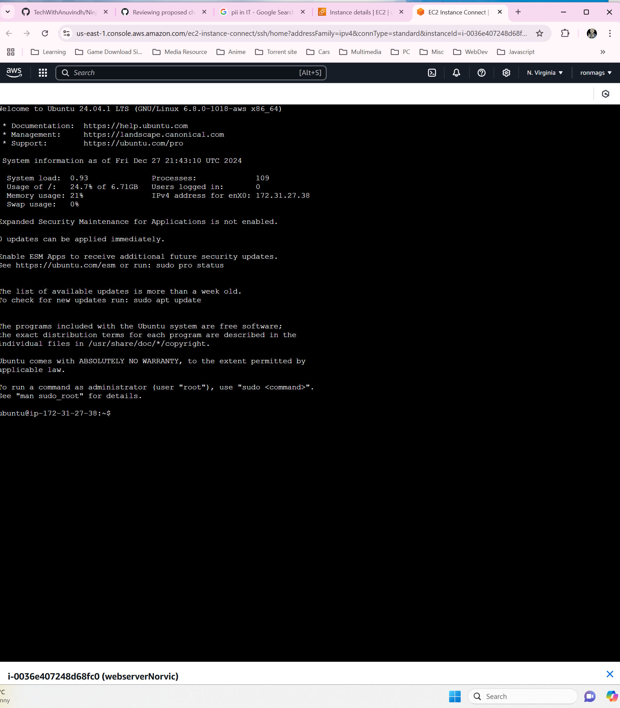
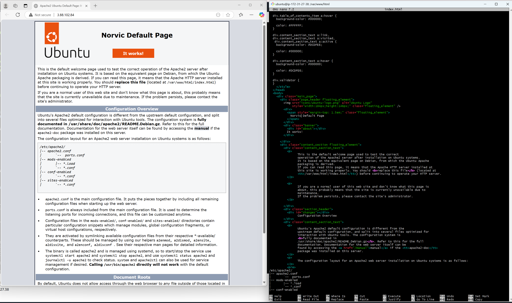

# Day 03 notes

## AWS Basics

**Activity**
-   Launch EC2 Instance (via AWS)
-   SSH Access - (Web based, via Git Bash)
-   Setup LAMP Server | (Linux, Apache, MySQL, PHP)
-   Install Git and Configure Script
-   Edit Website
-   Check website via Browser

### Steps

**Launch Virtual Machine Instance**
-   In AWS Dashboard goto EC2 and Launch Instance
-   Create Name, Select Ubuntu, Type: t2, Free tier, Key pair
-   In Security Group > Add Inbound port rules > SSH (Port 22), HTTP(port 80)

**Connect to EC2**
-   via EC2 Instance connect 
-   via SSH Client - using Gitbash:
    -   Right click on Folder where Key Pair (.pem) is downloaded
    -   type chmod 400 "xxxxxx.pem" then 
    -   type ssh -i "xxxxx.pem" ubuntu@ec2-3-88-102-84.compute-1.amazonaws.com

**Install Git and Script**
-   Check update: sudo apt-get update
-   Install Git: sudo apt install git-all
-   Clone Repository: git clone https://github.com/anuvindhs/GFS-Moo
-   Check directory: ls cd GFS-Moo/
-   Turn install.sh to executable: sudo chmod +x install.sh
-   Install script : ./install.sh then select 1 to install LAMP server
-   restarting server: sudo service apache2 restart

**Accessing and editing website**
-  Goto html directory: sudo nano /var/www/html/index.html
-  in Nano, CTRL+O to save, CTRL+X to exit

**Screenshots**
-   Connect Instance using Gitbash

-   Flowchart

-   Install Repo

-   Install LAMP

-   Install VM in AWS

-   Connect SSH via Browser

-   Edit Website
