# What is AWS EC2 All About?

**AWS EC2 (Elastic Cloud Compute) is a service that allows users to rent virtual servers in Amazon's Data Centers. It provides scalable and secure cloud computing platform to deploy applications and virtual machines.**

**What is EC2?**
-   A service Amazon offers and is the Core compute of AWS technology. It allows developers secure and compute in the cloud.

**Key Features**
-   Scalability - launch up or down mutiple instances.
-   Auto-Scaling - Adjust automatically the number of instances.
-   Storage options - optimized storage for intensive tasks.
-   Instance configurations - configure instances with specific resources.
-   AWS IAM roles - Provide access management for instances.
-   Operating System options - Choose from various operating systems.

**How EC2 Works**

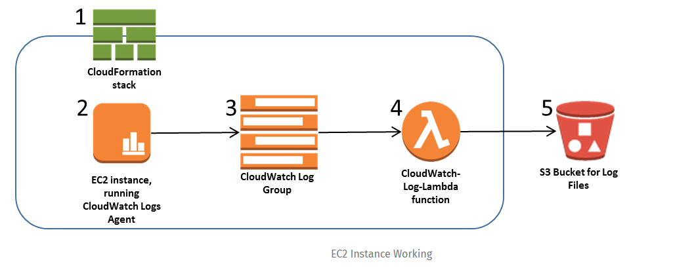

**Benefits**
-   Highly reliable and secure. Also provides Flexibility.

**Use cases**
-   Hosting websites, Running batch jobs, Hosting development environments

**Integration**
-   Works with Amazon S3 to store data.
-   Works with VPC to create Virtual Private Clouds.

**Getting Started**
-   Create and login to your AWS Account by going to aws.amazon.com
-   Identify the instance type like EC2 and use the Dashboard to launch instance and create your virtual machine.
-   Configure instance by creating firewall rules and choosing storage options.

**Best Practices**
-   Regularly backup using Amazon EBS snapshots.
-   Set TTL for applications to 255.
-   Manage access by creating IAM profiles.

**Challenges and Solutions**
-   Connectivity problems - Check network settings and make sure it is correct.
-   Slow performance - Use Autoscaling to add or remove instances based on demand.

**Pricing overview**
-   Pay per compute by the hour or second(minimum of 60 seconds) with no commitments. 

**Case Studies**
-   Social Media - develop a social media platform and data analytics.
-   Web Servers - Host stateless web servers.

**Conclusion**
-   EC2 allows users to develop and deploy applications faster with fewer hardware costs.

-------------------------------------------------

# AWS Security Groups and Elastic IP Address

**AWS Security Groups control traffic to resources and Elastic IP Address provide public IP addresses associated with resources.**

**What is Security Groups and Elastic IP Address**
-   Security Groups - Act like virtual firewalls and can be associated with EC2
-   Elastic IP Address - Can be associated with a network interface in a VPC.

**Key Features**
-   Security Groups - Rules can be configured based on protocols and IP address.
-   Elastic IP address - Provide consistent public endpoint for applications.

**How EC2 Works**

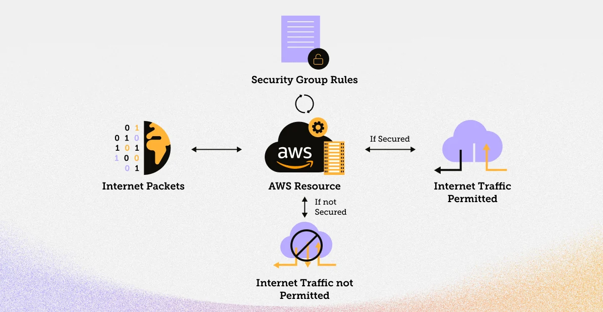
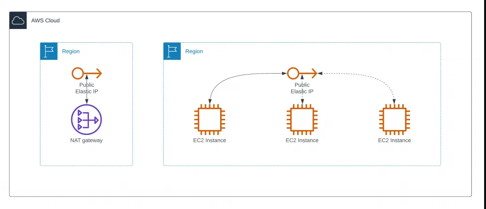

**Benefits**
-   Security Groups - prevent unauthorized access by restricting network access.
-   Elastic IP Address - Offers flexibility in how to manage network resources.

**Use cases**
-   Security Groups - Add roles and rules instance like Web Server and Database.
-   Elastic IP Address - hosting applications like web servers that needs a consistent public IP address.

**Integration**
-   Use Elastic IP address and VPC Security Groups with rules to filter incoming traffic.

**Getting Started**
-   Security Groups - limit security grous and enforce least privilage acces.
-   Elastic IP Address - allocate an Elastic IP address before using it as it incurs a cost.

**Best Practices**
-   Security Groups - restrict inbound access to required IP address and port.
-   Elastic IP Address - Use DNS names instead of EIPs if possible.

**Challenges and Solutions**
-   Security Groups - Optimize your VPC(Virtual Private Cloud) security groups to bypass its limitations.
-   Elastic IP Address - Incurs costs, manage and release unused IP address and creating automated release process.

**Pricing overview**
-   Security Groups - No additional cost.
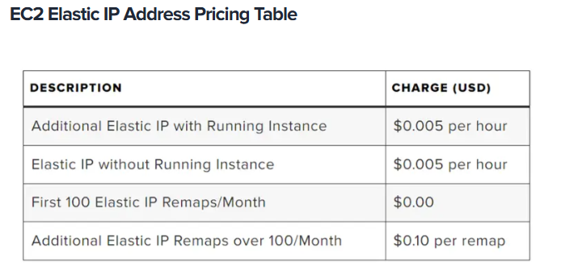

**Case Studies**
-   Security Groups - Control traffic to resources by associating it to subnets.
-   Elastic IP Address - High availability for web servers.

**Conclusion**
-   Both are important for managing and securing cloud-based infrastructure.

-----------------------------------------------------------------------------

# What in the world is AWS S3?

**AWS S3 (Simple Storage Service) is an object storage service that offers scalability, data availability.**

**What is S3?**
-   Store and retrieve any amount of data at anytime and from anywhere.

**Key Features**
-   Storage management - lets you control how data is stored and organized.
-   Access Management - control who has access to the data.
-   Scalability - accomodate any amount of data.
-   Flexibility - supports various data formats.

**How S3 Works**

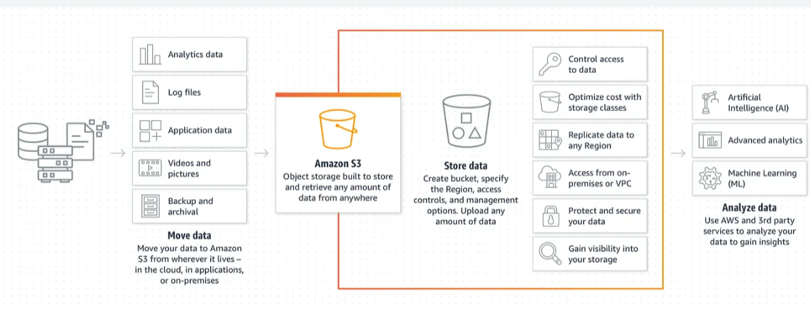

**Benefits**
-   Store infinite amount of data, low latency.

**Use cases**
-   Web hosting, backup and disaster recovery.

**Integration**
-   Uses an API to save information and organized it to buckets.

**Getting Started**
- In AWS Console launch S3 then create bucket in S3 Dashboard.
- Configure bucket then create the bucket then open it and start uploading data.

**Best Practices**
-   Ensure the S3 buckets use the correct policies and not publicly accessible by implementing least privilege access.

**Challenges and Solutions**
-   Configuration mistakes - Automate Configuration monitoring.

**Pricing overview**
-   

**Case Studies**
-   Disaster recovery, Big Data and Analytics, Backup.

**Conclusion**
-   AWS S3 provides reliable, secure and scalable storage.
----------------------------------------------------------------

# The Relationship of Amazon and RDS

**AWS RDS (Relational Database Service) is an easy to manage cloud service to operate a relational database.**

**What is RDS?**
-  An affordable relational database optimized in the cloud. 

**Key Features**
-   Easy to manage and deploy using Console, CLI, SDK or API calls.
-   Customizable storage options
-   High availability and durability with automated backups.
-   Security compliant with encryption 

**How RDS Works**

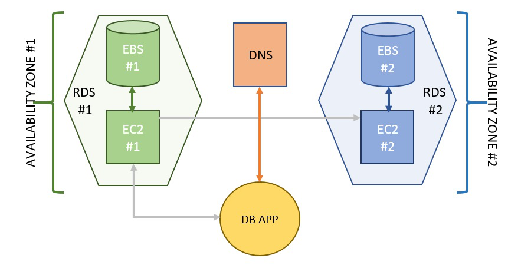

**Benefits**
-   Provides cost efficient, resizable capacity database which manages common database administration tasks.

**Use cases**
-   Web and mobile apps as a backend database providing availability and storage.

**Integration**
-   Monitor a collection of cloud database service and collect metrics.

**Getting Started**
-   Create a user with Administrative access
-   Determine the requirements based on need
-   Provide access to DB instance in VPC by creating a security group.

**Best Practices**
-   Use metrics to monitor usage of resources by using Amazon CloudWatch and scale up DB instance if approaching resource limits.

**Challenges and Solutions**
-   Access control to protect data - Using AWS tools like IAM Access Analyzer to maintain access controls.
-   Encryption - Use IAM policies to secure data.

**Pricing overview**
-   

**Case Studies**
-   Web Applications in mobile, web, gaming and also Data analytics.

**Conclusion**
-   RDS is an optimized database service which is simple to setup, operate, and scale that is cost efficient.

---------------------------------------------------------

# The Wavelength of Lambda

**AWS Lambda is a compute service that runs code and automatically manages compute resources.**

**What is Lambda?**
-  Runs your code without provisioning or managing servers.

**Key Features**
-   Versions - manage deployment with versions using beta testing for stable production version.
-   Lambda Libraries - Package libraries and other dependencies to reduce size of deployment.
-   Private networking - create a private network for resources like databse.
-   Function URL - add a dedicated HTTP(S) endpoint to a lambda function.

**How Lambda Works**

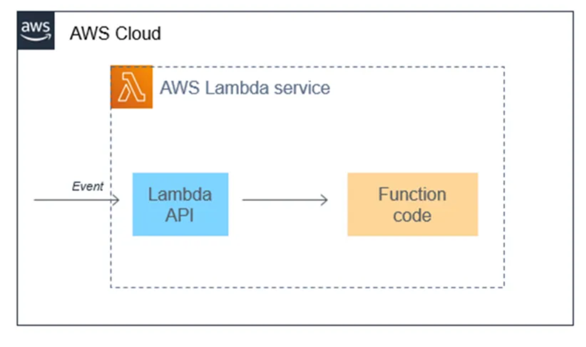

**Benefits**
-   No need to manage servers, automatic scaling, Pay as you go pricing.

**Use cases**
-  Credit card company used Lambda to save developer time thus improving speed to market and reducing cost by using serverless technology.

**Integration**
-   Build and API with Lambda integration

**Getting Started**
-   Developers write the code then pay only for execution time then upload code with simplified deployment for easy integration with other services.

**Best Practices**
-   Plan the deployment of the function code then use a keep alive directive to maintain connection. 

**Challenges and Solutions**
-   Limitation of a function run for 15 minutes - Break down processes into smaller ones.

**Pricing overview**
-   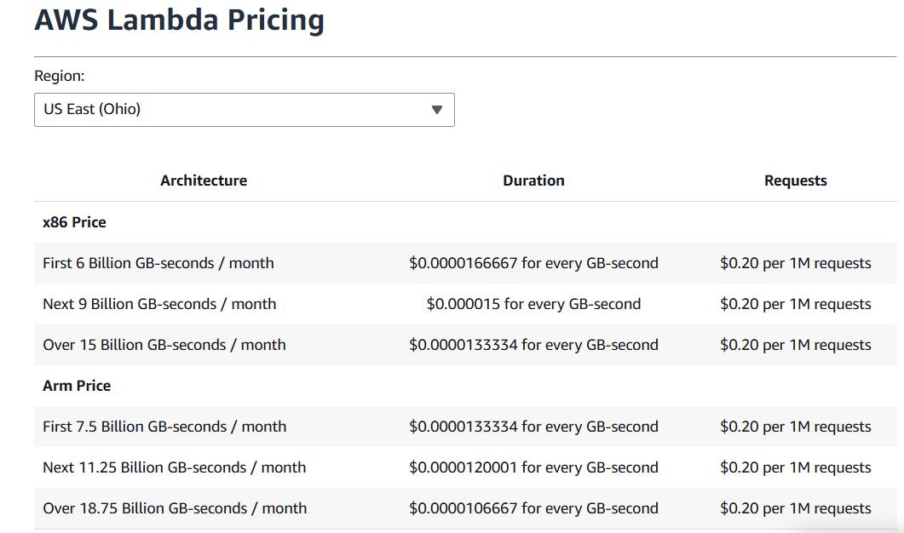

**Case Studies**
-   Data processing, Web APIs, File Processing.

**Conclusion**
-   AWS Lambda is a serverless compute service which executes code, handle compute resources which is cost effective especially in application development.

-------------------------------------------------------------------------

# The Dynamic DynamoDB

**AWS Dynamo DB is a serveless database with no server provisioning and management required.**

**What is Lambda?**
-  Serveless, NoSQL, fully managed database with high performance at any scale.

**Key Features**
-  Serverless - No provisioning of servers and software to install.
-  Security - uses IAM for authentication.
-  Cost-effectiveness -  uses on-demand capacity and pay for what is consumed.
-   Integration - Import and export from Amazon S3 Storage service.

**How Lambda Works**

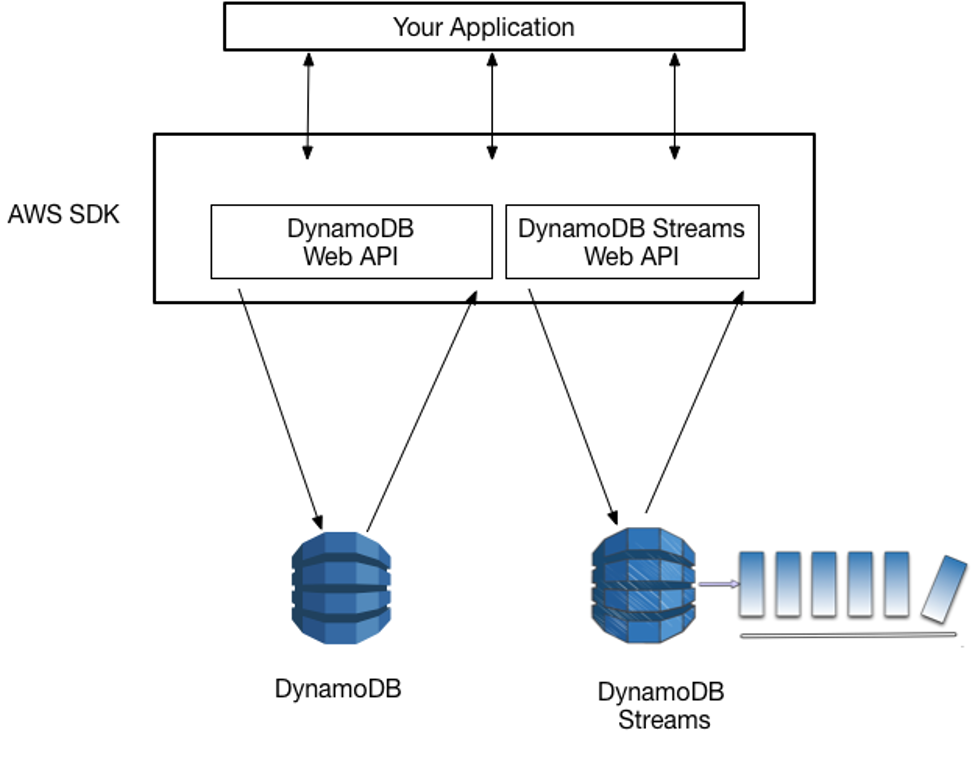

**Benefits**
-   Scalability - unlimited storage and can scale to zero.
-   Reliability - uptime of 99.9%

**Use cases**
-   Some companies that use DynamoDB are Dropbox and Zoom.

**Integration**
-   Automate repeating tasks and build applications that span multiple services.

**Getting Started**
-   Use the DynamoDB web service and also a downloadable version that runs on PC to help develop and test code.

**Best Practices**
-   Plan the deployment of the function code then use a keep alive directive to maintain connection. 

**Challenges and Solutions**
-   Limitation of a function run for 15 minutes - Break down processes into smaller ones.

**Pricing overview**
-   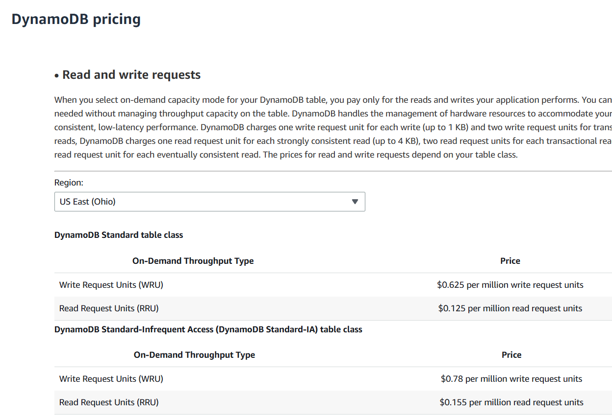

**Case Studies**
-   Streaming services, Online learning Platforms, Internet of Things

**Conclusion**
-   AWS DynamoDB is a solid database at scale that provides massive scalability for data and applications.

-------------------------------------------------

# What's up in AWS VPC?

**AWS VPC (Virtual Private Cloud)allows one to launch AWS resources in a logically isolated virtual network.**

**What is VPC?**
-  launch a virtual network with the benefits of using the scalable infrastructure of AWS.

**Key Features**
-   Configuration of subnets, Ip addressing, routing, Gateways and endpoints
-   Peering connections - use it to route traffic between the resources in two VPC's.
-   Traffic Mirroring - Copy network traffic from interfaces and send it to monitoring for inspection.
-   VPC flow logs - Captures information about the traffic going to and from the VPC.

**How VPC Works**

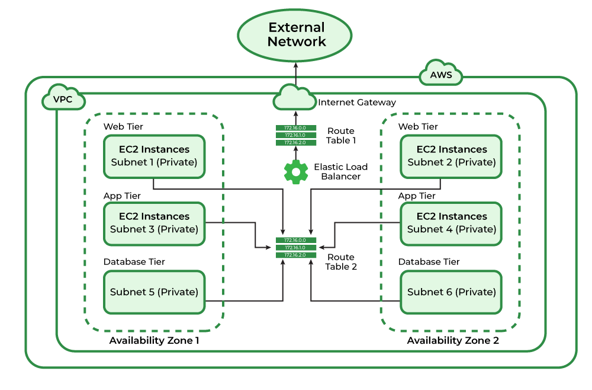

**Benefits**
-   Architecture - Customizable and the user has complete control of the network architecture.
-   Security - Enhanced and secure isolated environment.

**Use cases**
-   Hosting a public facing website, connecting to the internet via an internet gateway.

**Integration**
-   Both internet and Corporate Data Centre utilizing an internet Gateway and Virtual Private Gateway.

**Getting Started**
-   Setup VPC in the AWS Service Console and add resources like EC2, RDS instances.
-   Finally, configure VPCs to communicate with each other across availability zones.

**Best Practices**
-   Choose the appropriate VPC type and CIDR block, Isolate environment and use Multi-AZ deployments.

**Challenges and Solutions**
-   IP conflicts - Plan and design for scalability

**Pricing overview**
-   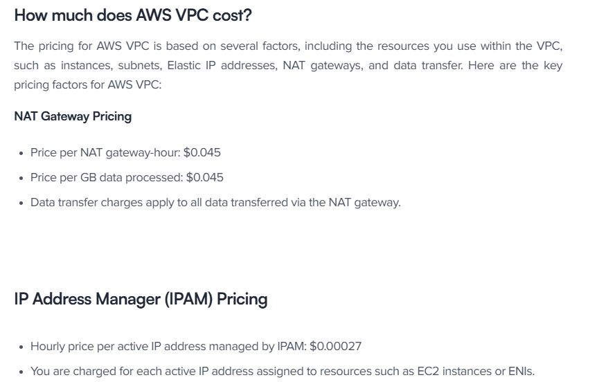

**Case Studies**
-   Host multi-tier web applications,create hybrid connections, launch a simple website.

**Conclusion**
-   AWS VPC is a core component that lets users create a virtual network which offers a secure and isolated environment.

-------------------------------------------------------------------

# Getting Ahead of CloudFront

**AWS CloudFront is a Content Delivery Network service that accelerates distribution of static and dynamic web content.**

**What is CloudFront?**
-  web service that speeds up the distribution of web content like html, css, js and image files to users.

**Key Features**
-   Availability - Redundancy by supporting multiple origins for backend architecture.
-   Security - Protection against network and application layer attacks.
-   Realtime metrics and logging - Integrated with CloudWatch and provides realtime logs.
-   Continous deployment - Deploy two separate identical environment safely.

**How CloudFront Works**

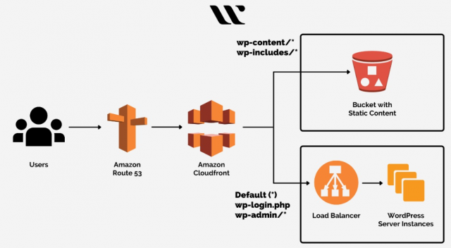

**Benefits**
-   Low Latency by caching content at locations close to users
-   High transfer speeds to deliver content quickly by using AWS backbone.

**Use cases**
-   Fast and secure websites, Stream live and on-demand video, distribute patches and updates.

**Integration**
-   Integrates with EC2, S3, Application Load Balancers or any custom HTTP origin.

**Getting Started**
-   Create an S3 bucket then upload content in the bucket then create a CloudFront distribution that uses S3 origin with OAC.

**Best Practices**
-   Analyze ussage patterns and select the appropriate pricing tier. 
-   Regularly monitor and analyze AWS CloudFront costs.

**Challenges and Solutions**
-   Caching related issues - Analyze cache behaviors and align it with your content's caching requirements.

**Pricing overview**
-   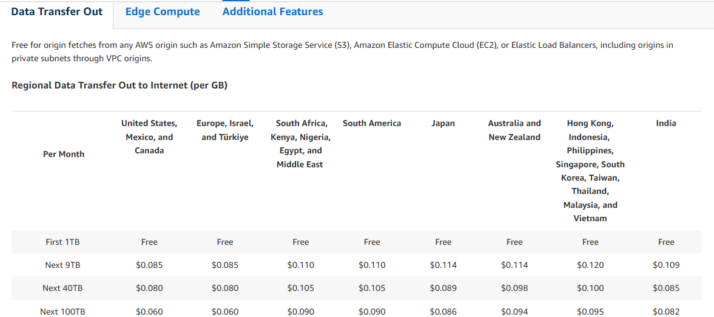

**Case Studies**
-   Full website delivery, Adaptive video streaming, API protection and acceleration.

**Conclusion**
-   AWS CloudFront delivers fast distribution of web content using a network of data centres providing low latency and performance.

--------------------------------------------------------------------------

 # I am what IAM

**AWS IAM (Identity and Access Management) is a service that helps administrators securely control access to AWS resources.**

**What is IAM?**
-  AWS service that you can use to authenticate and authorize the access of resources.

**Key Features**
-   Securely manage identities
-   Manage access controls in a granular level.
-   Temporarty security credentials.
-   Analyze and validate IAM Policies.

**How IAM Works**

**Benefits**
-   Centralized control of AWS accounts and provide granular permissions for specific resources.

**Use cases**
-   Centralized Identity and Access Management, Organized service policies, least privilege permissions.

**Integration**
-   Using IAM service to manage SAML (Security Assertion Markup Language) identity providers

**Getting Started**
-   Create an IAM role and grant permissions to manage AWS services and resources.

**Best Practices**
-   Enable Multi-Factor Authentication (MFA) for all IAM users to increase security.

**Challenges and Solutions**
-   Lack of visibility into account inventory - Centralize with IAM Identity Centre or integrate with Active Directory.

**Pricing overview**
-   Free of charge.

**Case Studies**
-   Manage per account access across AWS accounts and services, apply fine grained permissions.

**Conclusion**
-   AWS IAM is crucial for AWS as it is one of the foundation of everything and keeps data safe.

--------------------------------------------------------------------------

 # SES and SNS for Everyone

**AWS SES (Simple Email Service) and SNS (Simple Notification Service) is a service that includes message routing and broadcasting capabilities.**

**What is SES and SNS?**
-  SES is designed for high volum email delivery while SNS offers a flexible message delivery across channels.

**Key Features**
-   Allows publishers to send messages to specific topics
-   Message fanout that sends a message to multiple subscribers
-   Supports mutiple protocols
-   Message filtering

**How SES and SNS Works**

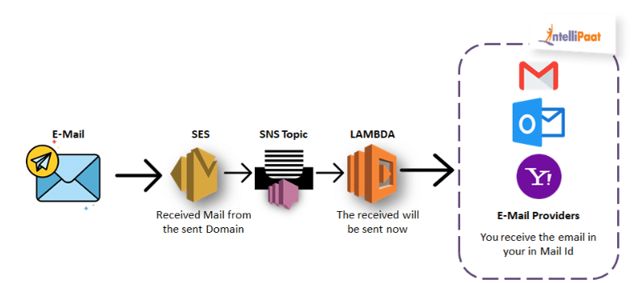

**Benefits**
-   Bulk messaging, competitive per use pricing, active monitoring of metrics

**Use cases**
-   Application monitoring to alert of critical events, Mobile app notifications, Automated workflows.

**Integration**
-   Configure AWS SNS notifications for Amazon SES to notify bounces and delivers it through SNS.   

**Getting Started**
-   SES - Setup SES account, Grant programmatic access (IAM), download AWS SDK to use SES APIs.
-   SNS - Create a topic using SNS console then enable encryption.

**Best Practices**
-   Implement least privilege access to different permissions for specific tasks.

**Challenges and Solutions**
-   Lack of visibility into account inventory - Centralize with IAM Identity Centre or integrate with Active Directory.

**Pricing overview**
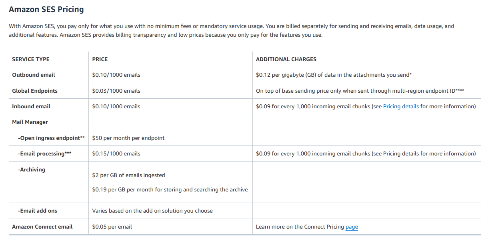
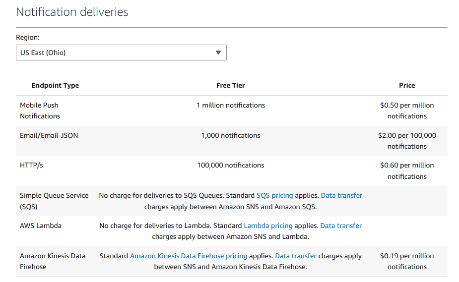

**Case Studies**
-   SES - Automate transactional messages, Globally deliver marketing emails
-   SNS - Push notifications, Distributed system architecture.

**Conclusion**
-   AWS SES and SNS is a suite of powerful services to handle messaging and communication needs.

----------------------------------------------------------

 # ELB for the Computing Weight

**AWS ELB (Elastic Load Balanceer) distributes incoming application traffic across multiple targets.**

**What is ELB?**
-  AWS service that distributes workloads across multiple compute resource like virtual servers.

**Key Features**
-   High throughput - designed to handle traffic as it grows.
-   Availability - distribute traffic across a single or multiple availability zone.
-   Health Checks - Insight to the health of applications.
-   Security - Create managed security groups.

**How ELB Works**

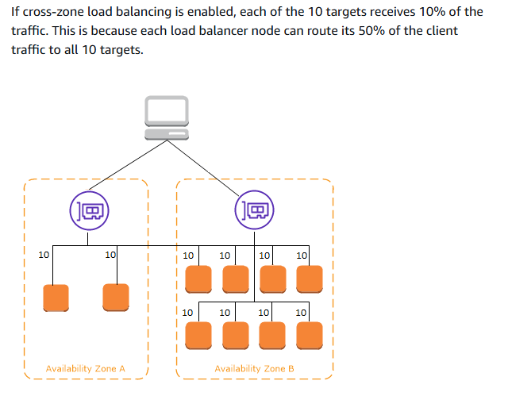

**Benefits**
-   Automatic scaling, Security, and Monitoring in real time.

**Use cases**
-   Modernize application with serverless and containers, Improve hybrid cloud network scalability.

**Integration**
-   Integrate API Gateway wit a public Application Load Balancer

**Getting Started**
-   Setup either an Application Load Balancer, Network Load Balancer, or Gateway Load Balancer through CLI or Console.

**Best Practices**
-   Optimize client connections by using connection pooling which re-uses connections.

**Challenges and Solutions**
-   Lack of reliability - deploy services and distribute traffic in multiple availability zones.

**Pricing overview**

**Case Studies**
-   Retain existing network appliance, scale modern applications without complex configurations.

**Conclusion**
-   AWS ELB is a service that distribute network traffic to improve application scalability.

-------------------------------------------------------------------------------

 # Watch out for CloudWatch

**AWS CloudWatch discussion about monitoring and observability features to monitor AWS resources.**

**What is CloudWatch?**
-  AWS CloudWatch monitors AWS resources and the applications that run on AWS real time.

**Key Features**
-   CloudWatch dashboard - provides a user friendly console to display metrics of resources.
-   Alerts - send notifications when a threshold is breached.
-   Logs - collects monitoring and operational data.
-   Automated actions - take automated actions based on data collected.

**How CloudWatch Works**

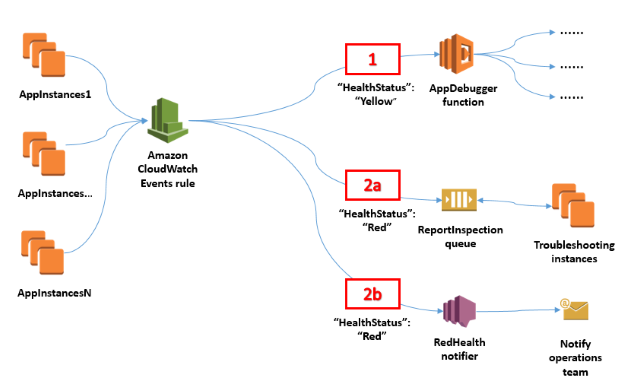

**Benefits**
-   Operational visibility and performance, detailed insights of applications, utilization and more.

**Use cases**
-   Monitor application performance, optimize resources proactively.

**Integration**
-   Integrate with RDS and VPC to publish logs.

**Getting Started**
-   Sign in to CloudWatch console then view or modify cross-service dashboard.

**Best Practices**
-   Use CloudWatch alarms to get realtime alerts on log patterns.

**Challenges and Solutions**
-   Ovelooking log retentions settings leading to unexpected costs - Set retention policies and use metric filters.

**Pricing overview**
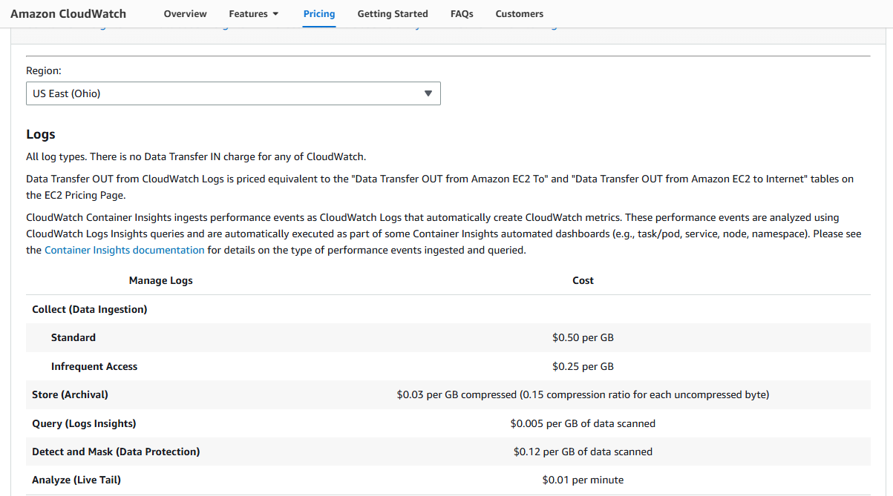

**Case Studies**
-  Web applications that use Real user monitoring and applications with log data.

**Conclusion**
-   AWS CloudWatch is a monitoring tool to monitor and fix operational issues.

-----------------------------------------------------------------------

# The Road to Route 53

**AWS Route 53 is provides domain administration, DNS routing and health checking.**

**What is Route 53?**
-  AWS Route 53 is a scalable Domain Name System (DNS) web service. 

**Key Features**
-   Domain registration - register domain names for your website or web application.
-   DNS routing - routes internet traffic to the resources of your domain.
-   Health Checking - monitor health of resources to verify availability.
-   DNS Firewall - protects DNS queries by fitering outbound traffic.

**How Route 53 Works**

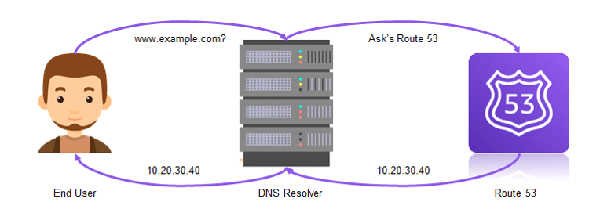

**Benefits**
-   High availability, Cost-effective, Reliability, and scalability.

**Use cases**
-   Manage network traffic globally, build highly available applications

**Integration**
-   Integrated with AWS CloudTrail to capture information and send it to route 53 API.

**Getting Started**
-   Register domain names, then configure DNS routing, and setup health checks.

**Best Practices**
-   Use alias instead of CNAME records to improve performance.

**Challenges and Solutions**
-   Slow DNS propagation - Ensure to get certificates after successful propagation.

**Pricing overview**
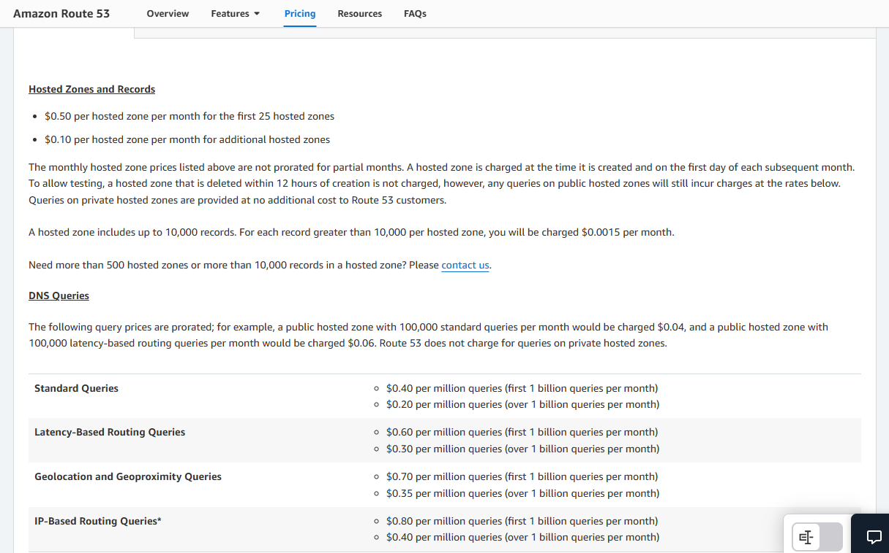

**Case Studies**
-  Managing global AWS local zones applications with Route 53 Geoproximity routing.

**Conclusion**
-   AWS Route 53 is a reliable and cost effective way to route end users to internet applications.

---------------------------------------------------------------------

# The Magnificent Amazon Bedrock

**AWS Amazon Bedrock evaluates foundation models for use cases, privately customer with your data.**

**What is Amazon Bedrock?**
-  AWS Amazon Bedrock is a fully managed service that makes foundation models available through API. 

**Key Features**
- Access to range leading foundation models
-   Simplified and managed experience for GenAI applications
-   Built-in security, privacy, and safety
-   Model customization  

**How Amazon Bedrock Works**

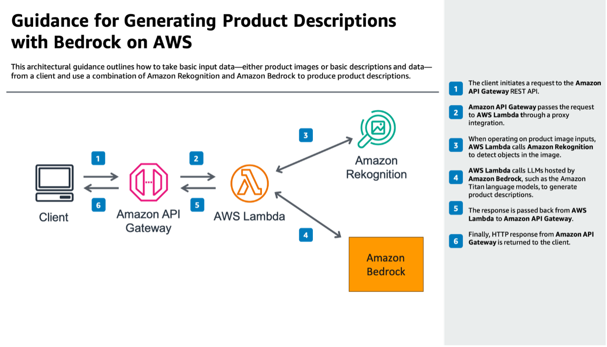

**Benefits**
-   Flexibility and customization, Data security and compliance.

**Use cases**
-   Text generation, virtual assistants, text and image search.

**Integration**
-   Integrates with AWS S3 for data storage allowing efficient data management.

**Getting Started**
-   Familiarize with terms and concepts of the service especially understanding how it charges for usage.

**Best Practices**
-   Enable comprehensive logging and observability, optimize model selection for cost and performance.

**Challenges and Solutions**
-   Integration with existing data pipelines - utilize AWS Glue for data preparation and integration.

**Pricing overview**
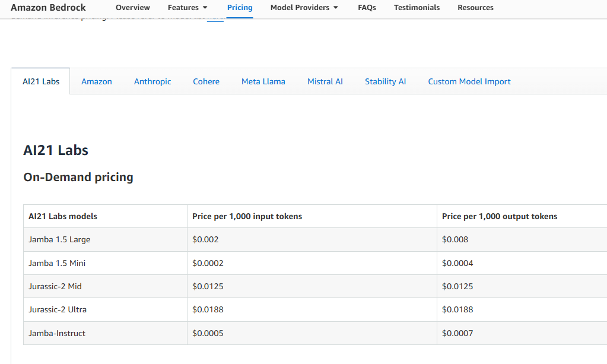

**Case Studies**
-  Content generation, creative design, Chatbot systems.

**Conclusion**
-   AWS Bedrock offers a comprehensive platform for training and fine-tuning foundation models.

----------------------------------------------------------------------

# Are you open to OpenSource?

**OpenSource is a way of creating and sharing software that anyone can modify and improve.**

**What is OpenSource?**
-  AWS Amazon Bedrock is a fully managed service that makes foundation models available through API. 

**Use cases**
-   Software with source code that anyone can inspect, modify, and enhance.

**Advantages**
-   Main advantage of opensource is community support, cost savings, and flexibility.

**Disadvantages**
-   Compatibility and integration, security risks, intellectual property concerns.

**Examples**
-   Mozilla, Python, VLC Media Player, Linux

**Case Studies**
-  Apache is an opensource project and also MySQL.

**Conclusion**
-   OpenSource is a versatile solution for various applications across industries.

----------------------------------------------------------------------------------